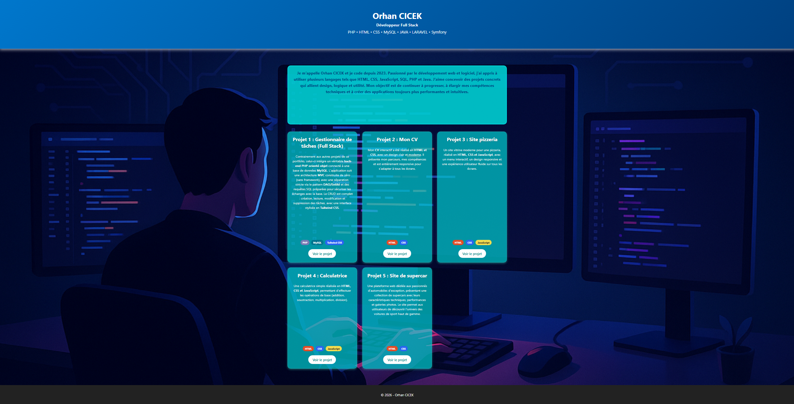

# 👋 Portfolio — Orhan CICEK

**Développeur Full Stack** — PHP • Java • MySQL • Laravel • Symfony • HTML • CSS • JavaScript

Bienvenue sur mon portfolio ! Ce site présente mon parcours, mon CV ainsi qu'une sélection de projets réalisés au cours de ma formation et de mes expériences en développement web et logiciel.

🔗 **Portfolio en ligne :** [orhan54.github.io/portfolio](https://orhan54.github.io/portfolio/)
💻 **Code source :** [github.com/orhan54](https://github.com/orhan54)

---

## 🧭 Sommaire

- [À propos](#-à-propos)
- [Aperçu du portfolio](#-aperçu-du-portfolio)
- [Projets](#-projets)
  - [1. Application Full Stack](#1-application-full-stack)
  - [2. Mon CV](#2-mon-cv)
  - [3. Site pizzeria](#3-site-pizzeria)
  - [4. Calculatrice](#4-calculatrice)
  - [5. Site de supercar](#5-site-de-supercar)

- [Technologies utilisées](#-technologies-utilisées)
- [Structure du dépôt](#-structure-du-dépôt)
- [Lancer le projet en local](#-lancer-le-projet-en-local)
- [Contact](#-contact)

---

## 🎯 À propos

Je m'appelle **Orhan CICEK** et je code depuis 2023.

Passionné par le développement web et logiciel, j'ai développé des compétences dans plusieurs technologies et langages, notamment **HTML, CSS, JavaScript, PHP, SQL et Java**.

Au cours de mes formations et expériences, j'ai travaillé sur différents types de projets allant de l'intégration front-end au développement d'applications **Full Stack** avec gestion de bases de données.

J'ai notamment acquis des connaissances en **architecture MVC, DAO, gestion des entités, développement d'API, bases de données relationnelles, tests, Git, Docker et CI/CD**.

Mon objectif est de continuer à développer mes compétences et d'évoluer vers des projets de plus en plus orientés **développement logiciel, architecture et Full Stack**.

---

## 🖼️ Aperçu du portfolio

Voici un aperçu de la page d'accueil de mon portfolio :



Depuis la page d'accueil, les projets sont présentés sous forme de cartes avec leur description, leurs technologies et un accès direct à leur réalisation.

---

## 📂 Projets

### 1. Application Full Stack

Application web développée en **PHP** avec une base de données **MySQL**.

Ce projet met en œuvre une architecture structurée avec la gestion des **entités** et de la **DAO (Data Access Object)** afin de séparer la logique applicative de l'accès aux données.

L'interface utilise **Tailwind CSS** pour la mise en forme et propose une gestion des données à travers différentes fonctionnalités **CRUD**.

L'application a également été **déployée et hébergée en ligne sur Kmer Hosting**, avec sa base de données MySQL, permettant d'utiliser le projet directement depuis un environnement web.

Ce projet représente une approche complète du développement web avec une partie **front-end, back-end, base de données et déploiement**.

**Technologies :** `PHP` `MySQL` `Tailwind CSS` `DAO` `Entités`

**Hébergement :** `Kmer Hosting`

---

### 2. Mon CV

Mon CV interactif a été réalisé en **HTML et CSS**, avec un design moderne et responsive.

Il présente mon parcours professionnel, mes formations, mes compétences techniques ainsi que mes expériences dans le développement web et logiciel.

Le design a été conçu pour s'adapter aux différents formats d'écran, notamment ordinateur, tablette et mobile.

**Technologies :** `HTML` `CSS`

---

### 3. Site pizzeria

Un site vitrine moderne pour une pizzeria, réalisé en **HTML, CSS et JavaScript**.

Le projet propose notamment un menu interactif, une présentation des produits et différentes interactions JavaScript.

Les données du menu sont également organisées à l'aide de fichiers **JSON**.

Le site est entièrement responsive afin de proposer une expérience adaptée aux différents écrans.

**Technologies :** `HTML` `CSS` `JavaScript` `JSON`

---

### 4. Calculatrice

Une calculatrice interactive réalisée en **HTML, CSS et JavaScript**.

Elle permet d'effectuer les principales opérations mathématiques :

- Addition
- Soustraction
- Multiplication
- Division

Le projet permet notamment de mettre en pratique la manipulation du **DOM**, les événements JavaScript et la gestion de la logique applicative côté client.

**Technologies :** `HTML` `CSS` `JavaScript`

---

### 5. Site de supercar

Une plateforme web dédiée aux passionnés d'automobiles d'exception.

Le site présente une sélection de supercars avec leurs caractéristiques techniques, leurs performances et différents éléments visuels permettant de découvrir l'univers des voitures de sport haut de gamme.

Le projet est principalement orienté **intégration HTML/CSS** et mise en valeur du contenu à travers une interface visuelle.

**Technologies :** `HTML` `CSS`

---

## 🛠️ Technologies utilisées

| Technologie      | Usage                                                          |
| ---------------- | -------------------------------------------------------------- |
| **HTML5**        | Structure et organisation des pages                            |
| **CSS3**         | Mise en page, responsive design et animations                  |
| **JavaScript**   | Interactivité et logique côté client                           |
| **JSON**         | Stockage et manipulation de données pour certains projets      |
| **PHP**          | Développement back-end et logique applicative                  |
| **MySQL**        | Gestion des bases de données relationnelles                    |
| **Tailwind CSS** | Création des interfaces du projet Full Stack                   |
| **DAO**          | Séparation de l'accès aux données et de la logique applicative |
| **Git / GitHub** | Gestion et versionnement du code                               |

### Autres technologies

Ma stack de développement comprend également des technologies étudiées et utilisées dans le cadre de mes formations et projets :

`Java` • `Spring Boot` • `Laravel` • `Symfony` • `SQL` • `Bootstrap` • `Docker` • `Maven` • `JUnit` • `Allure` • `Sonar` • `Jenkins`

---

## 📁 Structure du dépôt

```text
portfolio/
├── public/
│   ├── index.html
│   │
│   ├── css/
│   │   ├── style.css
│   │   ├── cv.css
│   │   ├── pizza.css
│   │   ├── calculatrice.css
│   │   ├── corvette.css
│   │   └── voiture.css
│   │
│   ├── js/
│   │   └── ...
│   │
│   ├── json/
│   │   └── *.json
│   │
│   ├── images/
│   │   ├── portfolio-preview.png
│   │   └── ...
│   │
│   └── view/
│       ├── fullstack/
│       │   └── ...
│       ├── cv/
│       │   └── cv.html
│       ├── pizza/
│       │   └── ...
│       ├── calculatrice/
│       │   └── ...
│       └── voiture/
│           └── ...
│
└── README.md
```

---

## ⚙️ Lancer le projet en local

Pour les projets front-end, aucune installation particulière n'est nécessaire.

### 1. Cloner le dépôt

```bash
git clone https://github.com/orhan54/portfolio.git
```

### 2. Accéder au dossier

```bash
cd portfolio
```

### 3. Lancer le projet

Ouvrir le fichier :

```text
public/index.html
```

dans un navigateur.

Il est également recommandé d'utiliser un serveur local, notamment pour les projets utilisant des fichiers JSON.

Avec **Live Server** dans VS Code ou avec Python :

```bash
python -m http.server
```

Puis accéder à :

```text
http://localhost:8000
```

---

## 📬 Contact

- **Email :** [orhancicek1985@gmail.com](mailto:orhancicek1985@gmail.com)
- **GitHub :** [github.com/orhan54](https://github.com/orhan54)
- **Portfolio :** [orhan54.github.io/portfolio](https://orhan54.github.io/portfolio/)

---

<p align="center">
  Fait avec ❤️ par Orhan CICEK
</p>
```